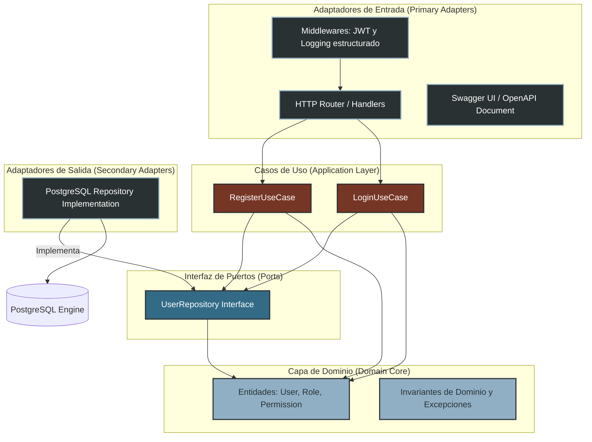
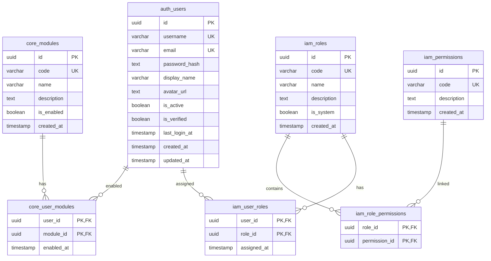
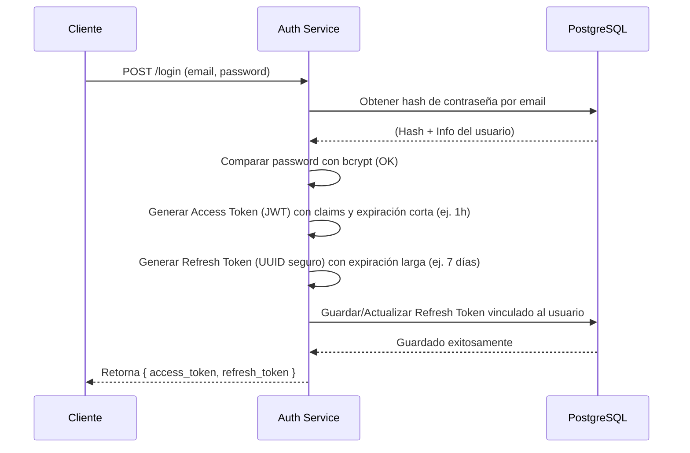
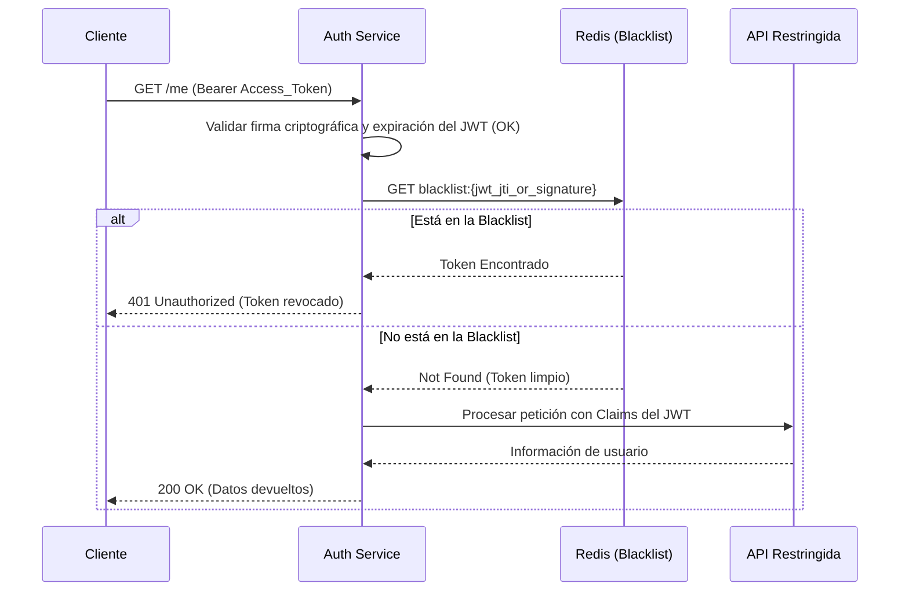
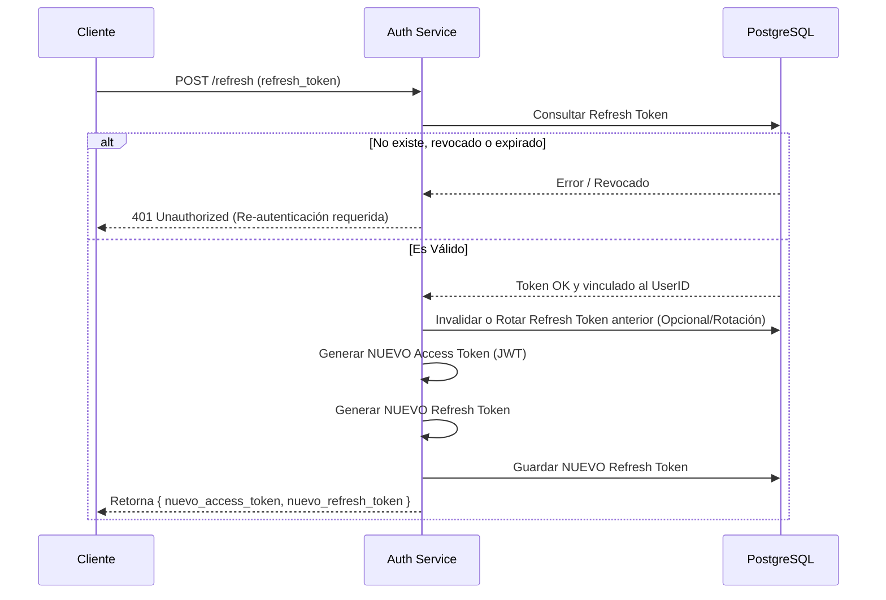
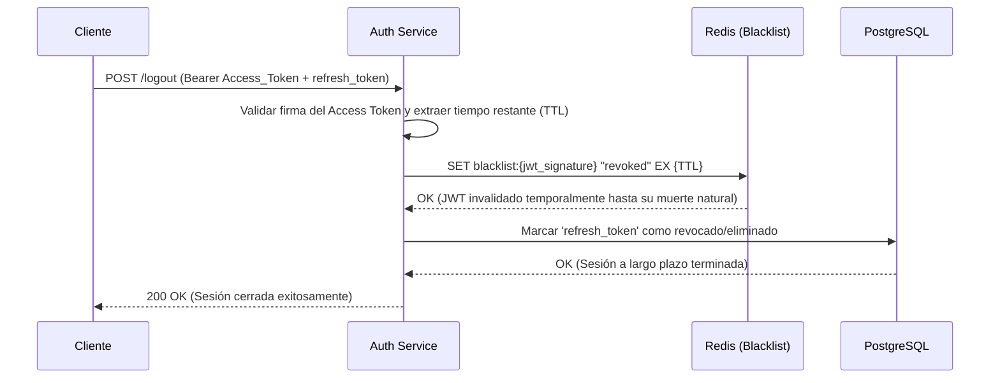
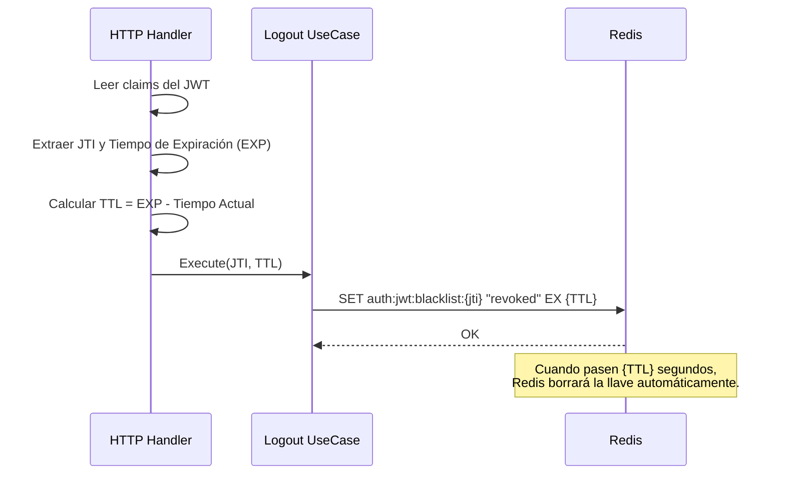
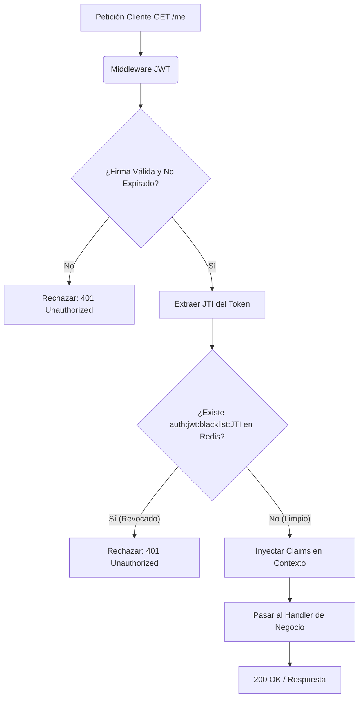
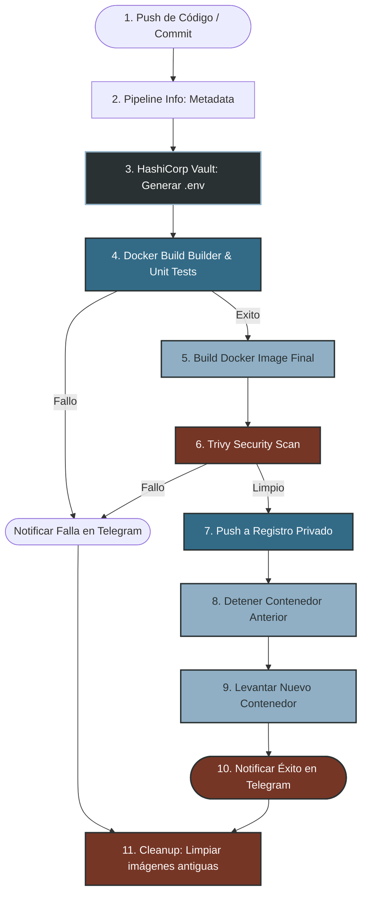

# Especificación de Arquitectura de Software: Servicio de Autenticación e IAM

Este documento define la arquitectura, el modelo de datos, los contratos de interfaz y los procedimientos de despliegue para el microservicio de Autenticación y Gestión de Identidad y Acceso (IAM).

El diseño del servicio está fundamentado en el patrón de **Arquitectura Hexagonal (Puertos y Adaptadores)** y los principios de **Diseño Guiado por el Dominio (DDD)**. Su implementación se realiza de forma nativa utilizando la librería estándar de Go, optimizando el rendimiento y garantizando el aislamiento de componentes sin la adición de dependencias externas complejas.

---

## 1. Arquitectura del Sistema

La estructura del servicio aplica un desacoplamiento estricto. La regla fundamental de diseño arquitectónico establece que **las dependencias apuntan exclusivamente hacia el núcleo de dominio**. El dominio no posee acoplamientos conceptuales con protocolos de transporte (HTTP), mecanismos de persistencia (motores SQL o bases de datos) o formatos de serialización (JSON).

### Diagrama de Dependencias de Componentes



### Estructura del Workspace del Proyecto

```
auth/
├── cmd/
│   └── api/
│       └── main.go         # Punto de entrada de la aplicación (Orquesta el bootstrap)
├── db/
│   ├── migrations/         # Definición de esquemas físicos PostgreSQL
│   └── seed.sql            # Script de inicialización de datos estáticos y permisos de sistema
├── internal/
│   ├── bootstrap/          # Orquestación de inicio de servicios, inyección de dependencias y apagado
│   ├── domain/             # Capa del Dominio de Negocio
│   │   ├── model/          # Entidades puras y validación de reglas de negocio (User, Role, Permission)
│   │   └── port/           # Puertos de salida e interfaces de puertos de entrada
│   ├── usecase/            # Capa de Aplicación (Casos de uso de negocio puro)
│   └── infra/              # Capa de Infraestructura (Adaptadores del mundo exterior)
│       ├── config/         # Carga de variables de entorno y configuración del SO
│       ├── observability/  # Implementación técnica del logger estructurado y telemetría
│       ├── database/       # Implementación técnica de persistencia de datos (DB, Migraciones)
│       ├── cache/          # Implementación técnica del almacenamiento en memoria (Redis)
│       └── http/           # Capa de Transporte Web (Handlers, Rutas, JSON)
│           ├── router/     # Multiplexor nativo y configuración de rutas
│           ├── middleware/ # Interceptores HTTP (Validación JWT, Timeouts, Rate Limits)
│           └── response/   # Data Transfer Objects (DTOs) y formateo de respuestas JSON
```

---

## 2. Modelo de Dominio e Invariantes

La capa del Dominio encapsula las reglas críticas de negocio de manera aislada de los aspectos de transporte e infraestructura.

### Entidades y Estructuras de Datos

* **User**: Representa el sujeto de autenticación dentro del ecosistema. Contiene validación semántica integrada y utilidades para inspección de privilegios.
* **Role**: Representa la agrupación lógica de permisos jerárquicos (por ejemplo: `SUPER_ADMIN`, `ADMIN`, `USER`).
* **Permission**: Define un privilegio granular e indivisible dentro de la plataforma (por ejemplo: `USER_READ`, `MODULE_ENABLE`).

### Invariantes de Dominio y Validaciones Semánticas
Las invariantes se comprueban a través de métodos en la propia entidad de dominio (`Validate()`):
* **Integridad del Formato de Correo**: Validación sintáctica a través de expresión regular precompilada (`emailRegex`).
* **Nombre de Usuario Homologado**: Debe contener entre 3 y 50 caracteres alfanuméricos simples y no poseer caracteres especiales.
* **Seguridad de Acceso**:
  * `HasRole(roleCode)`: Retorna si un usuario cuenta con un rol específico asignado.
  * `HasPermission(permissionCode)`: Evalúa si un usuario posee un permiso a través de la herencia jerárquica de todos sus roles asignados de forma recursiva.
  * `GetAllPermissions()`: Agrupa y retorna un set único de códigos de permisos válidos del usuario (para codificar dentro de los claims de los tokens JWT de forma eficiente).

---

## 3. Modelo de Datos y Esquema Físico (PostgreSQL)

La base de datos relacional PostgreSQL está estructurada en tres esquemas lógicos independientes (`auth`, `iam`, `core`) para garantizar el aislamiento de datos y la consistencia referencial.

### Diagrama Entidad-Relación (ERD)



### Inicialización de Semillas y Roles del Sistema (`db/seed.sql`)
La estructura inicial del sistema define por defecto los siguientes accesos parametrizados:
* **Roles de Sistema**: `SUPER_ADMIN` (Control absoluto), `ADMIN` (Administrador general), `USER` (Usuario base).
* **Módulos Disponibles**: `VIDEO_GAMES` (Videojuegos), `TCG` (Cartas intercambiables), `FIGURES` (Figuras), `RETRO` (Retro Gaming).
* **Permisos del Ecosistema**: `USER_READ`, `USER_CREATE`, `USER_UPDATE`, `USER_DELETE`, `ROLE_READ`, `ROLE_ASSIGN`, `MODULE_READ`, `MODULE_ENABLE`.

---

## 4. Guía de Instalación y Despliegue en Desarrollo

### Requisitos Técnicos
* **Entorno de Ejecución Go** (Versión 1.22 o superior).
* **Instancia Activa de PostgreSQL** (Configurada y accesible según los parámetros indicados en las variables de entorno).

---

### Paso 1: Configuración de Variables de Entorno
Cree o modifique el archivo `.env` localizado en el directorio raíz de la carpeta `auth/`. Deberá rellenar los datos de conexión según los parámetros de su infraestructura local o servidor de datos:

```bash
# Puerto de escucha del servidor HTTP del microservicio Auth
PORT=

# Configuración de seguridad JWT
JWT_SECRET=
JWT_EXPIRATION_HOURS=

# Configuración de base de datos PostgreSQL
DB_HOST=
DB_PORT=
DB_USER=
DB_PASSWORD=
DB_DATABASE=
DB_SSLMODE=
```

*Nota: Para que el servicio inicie correctamente, el esquema físico de base de datos (ubicado en `db/migrations/`) y las semillas de inicialización (`db/seed.sql`) deben haber sido aplicados previamente en la instancia de PostgreSQL especificada.*

---

### Paso 2: Ejecución del Microservicio de Autenticación
Desde la carpeta raíz del servicio `auth/`, ejecute el compilador de Go:

```bash
go run cmd/api/main.go
```

Tras la validación de dependencias y el inicio del servidor, se desplegará el panel de inicio del microservicio en la salida estándar de consola:

```
========================================================================
   ____    _   _  _____  _   _      ____   _____  ____  
  / ___|  | | | ||_   _|| | | |    / ___| |  ___||  _ \ 
 | |      | | | |  | |  | |_| |    \___ \ | |_   | |_) |
 | |___   | |_| |  | |  |  _  |     ___) ||  _|  |  _ < 
  \____|   \___/   |_|  |_| |_|    |____/ |_|    |_| \_\
                                                        
       HOMELAB COLLECTOR PLATFORM SKAOTICO V2 - AUTH SERVICE V1.3
========================================================================
 [+] PUERTO:          9090
 [+] SWAGGER UI:      http://localhost:9090/swagger/
 [+] SWAGGER JSON:    http://localhost:9090/swagger/doc.json

 [ENDPOINTS DISPONIBILIZADOS]:
  -> POST /api/v1/auth/register    [Registro de usuarios (Público)]
  -> POST /api/v1/auth/login       [Inicio de sesión / Token (Público)]
  -> GET  /api/v1/auth/me          [Visualizar claims del JWT (Protegido)]
========================================================================
```

---

## 5. Especificación y Contratos de la API HTTP

La plataforma cuenta con soporte interactivo embebido para visualización e interacción de APIs mediante **Swagger UI** (con interfaz visual optimizada en modo oscuro).

* **Consola Interactiva Swagger UI**: [http://localhost:9090/swagger/](http://localhost:9090/swagger/)
* **Documentación OpenAPI JSON**: [http://localhost:9090/swagger/doc.json](http://localhost:9090/swagger/doc.json)

### Endpoints Disponibles

#### 1. POST `/api/v1/auth/register` (Público)
Registra y persiste una cuenta de usuario inicial.
* **Payload de Petición (JSON)**:
  ```json
  {
    "username": "skaotico",
    "email": "skaotico@homelab.local",
    "password": "adminpassword"
  }
  ```
* **Respuesta Exitosa (HTTP 201 Created)**:
  ```json
  {
    "success": true,
    "data": {
      "id": "c83f2e1a-42c2-401d-9db8-3be38cd48512",
      "username": "skaotico",
      "email": "skaotico@homelab.local"
    }
  }
  ```

#### 2. POST `/api/v1/auth/login` (Público)
Inicia sesión y devuelve el token JWT firmado que contiene los claims del usuario y sus privilegios asociados.
* **Payload de Petición (JSON)**:
  ```json
  {
    "email": "skaotico@homelab.local",
    "password": "adminpassword"
  }
  ```
* **Respuesta Exitosa (HTTP 200 OK)**:
  ```json
  {
    "success": true,
    "data": {
      "token": "eyJhbGciOiJIUzI1NiIsInR5cCI6IkpXVCJ9..."
    }
  }
  ```

#### 3. GET `/api/v1/auth/me` (Protegido por JWT)
Permite verificar la integridad de las credenciales activas del token JWT.
* **Cabecera Requerida**: `Authorization: Bearer <TOKEN>`
* **Respuesta Exitosa (HTTP 200 OK)**:
  ```json
  {
    "success": true,
    "data": {
      "user_id": "c83f2e1a-42c2-401d-9db8-3be38cd48512",
      "email": "skaotico@homelab.local",
      "roles": ["USER"],
      "permissions": ["MODULE_READ"],
      "exp": 1748283482
    }
  }
  ```

---

## 6. Estandarización de Respuestas y Control de Errores

Con el objetivo de proveer predictibilidad y consistencia para los desarrolladores de Frontend y sistemas clientes, el microservicio implementa la interfaz de envoltura unificada `APIResponse` mediante el subpaquete `internal/adapter/handler/http/response/`.

### Formato de Respuestas Comunes

* **Flujo Exitoso**:
  ```json
  {
    "success": true,
    "data": { ... }
  }
  ```

* **Flujo Fallido (Estructura de APIError)**:
  ```json
  {
    "success": false,
    "error": {
      "code": "AUTH_005",
      "message": "Credenciales inválidas, verifique su correo o contraseña"
    }
  }
  ```

### Tabla de Códigos de Error de Negocio e Infraestructura

| Código de Error | Criterio de Activación Técnica |
|---|---|
| **`SYS_001`** | Falla interna del servidor (falla de conectividad Postgres, error al procesar base de datos). |
| **`SYS_002`** | Payload JSON malformado o con errores sintácticos de entrada. |
| **`AUTH_001`** | Formato de correo electrónico inválido según regla regular del dominio. |
| **`AUTH_002`** | Nombre de usuario no cumple con el tamaño permitido (3-50) o contiene caracteres especiales. |
| **`AUTH_003`** | La longitud de contraseña suministrada es inferior al límite de seguridad exigido (6 caracteres). |
| **`AUTH_004`** | Conflicto de unicidad: Nombre de usuario o correo electrónico ya registrado en el sistema. |
| **`AUTH_005`** | Credenciales de acceso incorrectas (contraseña o email no válidos). |
| **`AUTH_006`** | Intento de inicio de sesión de usuario bloqueado o inactivo. |
| **`AUTH_007`** | Intento de consumo de endpoint protegido con JWT nulo, inválido, mal firmado o expirado. |

---

## 7. Librerías y Tecnologías Utilizadas

La aplicación está construida favoreciendo la librería estándar de Go (`net/http`, `database/sql`) e incluye dependencias externas estrictamente necesarias para funciones especializadas.

| Librería / Tecnología | Caso de Uso en el Proyecto |
|-----------------------|----------------------------|
| **Go Standard Library** | Motor principal para enrutamiento (`net/http`) y base de datos relacional nativa (`database/sql`) sin uso de ORM para máxima eficiencia. |
| **`github.com/golang-jwt/jwt/v5`** | Creación, parseo y validación criptográfica de tokens de acceso JWT (Access Tokens) bajo el estándar RFC 7519. |
| **`golang.org/x/crypto/bcrypt`** | Generación de hashes seguros unidireccionales (salting & hashing) para el almacenamiento de contraseñas de usuarios. |
| **`github.com/lib/pq`** | Driver nativo para PostgreSQL. Permite la comunicación entre `database/sql` y el servidor de BD Postgres. |
| **`github.com/golang-migrate/migrate/v4`** | Motor de migraciones (Up/Down) que ejecuta los archivos SQL (`db/migrations/`) programáticamente al inicializar la app. |
| **`github.com/redis/go-redis/v9`** | Cliente de Redis. Se utiliza de manera crítica para gestionar la **Blacklist de JWT revocados** temporalmente. |
| **`github.com/google/uuid`** | Generación y manejo seguro de UUIDs versión 4 para identificar entidades (Usuarios, Roles, Tokens) evitando IDs predecibles. |

---

## 8. Gestión Avanzada de Sesiones: Access Tokens y Refresh Tokens

El sistema implementa una arquitectura dual de tokens orientada a la máxima seguridad. Se utilizan **Access Tokens (JWT)** sin estado para autorización veloz, y **Refresh Tokens** persistidos en base de datos para controlar la duración de sesiones prolongadas.

### Rol de los Servicios de Almacenamiento

| Servicio | Rol en la Autenticación | Casos de Uso Específicos |
|----------|------------------------|--------------------------|
| **PostgreSQL (BD)** | Persistencia de Refresh Tokens y usuarios. | - Guardar el `refresh_token` generado de manera segura (con hash opcional).<br>- Validar, revocar y expirar Refresh Tokens.<br>- Bloquear sesiones de dispositivos específicos o usuarios comprometidos a nivel base de datos. |
| **Redis (Caché)** | Almacén de alta velocidad en memoria para efímeros. | - **Blacklist de JWT**: Cuando un usuario cierra sesión, el Access Token (que aún es válido) se guarda en Redis con un TTL igual a su expiración original.<br>- Mitigación de robo de tokens (invalidación forzosa inmediata). |

---

### Diagrama 1: Flujo de Inicio de Sesión (Login)

Este flujo describe cómo se emite el par de tokens tras una validación exitosa de credenciales.



---

### Diagrama 2: Validación y Uso de Access Token (Petición Protegida)

Este flujo demuestra cómo Redis protege al sistema verificando si un JWT válido ha sido revocado prematuramente.



---

### Diagrama 3: Flujo de Refresco de Tokens (Refresh Flow)

Cuando un Access Token expira, el cliente utiliza el Refresh Token para obtener uno nuevo, validando el estado real del usuario en la Base de Datos.



---

### Diagrama 4: Flujo de Cierre de Sesión (Logout)

Este diagrama especifica la invalidación en ambos almacenes de datos: el JWT efímero en Redis, y el Refresh a largo plazo en Postgres.



---

### Detalles Técnicos de la Blacklist y Cálculo de TTL

La invalidación de tokens sin estado (JWT) es un desafío conocido, dado que el token vive en el cliente. Para solucionarlo sin comprometer el rendimiento ni saturar la memoria, el proyecto implementa un patrón avanzado de **Blacklist Dinámica basada en JTI (JWT ID) y TTL Exacto**.

#### 1. Cálculo Dinámico del TTL en el Logout
Cuando el usuario solicita el cierre de sesión (`/api/v1/auth/logout`), el servidor intercepta el JWT y extrae dos valores críticos:
- **`JTI` (JWT ID)**: El identificador único y aleatorio del token.
- **`EXP` (Expiration Time)**: El timestamp de cuándo expira naturalmente el token.

El controlador en la capa HTTP (`handler.go`) calcula el tiempo de vida restante exacto (TTL) restando el tiempo actual al tiempo de expiración:
```go
// Cálculo exacto de los segundos de vida restantes del token
ttl := int(expTime.Sub(time.Now()).Seconds())
```

#### 2. Inserción Eficiente en Redis
El caso de uso de Logout (`logout.go`) envía este TTL exacto al repositorio de caché (`redis_cache.go`). Redis guarda una llave con el formato `auth:jwt:blacklist:{jti}` estableciendo su valor a `"revoked"` y **configurando su expiración (EX) exactamente al TTL calculado**.

**¿Por qué es esto importante?**
- **Evita fugas de memoria (OOM)**: La llave en Redis se auto-destruye en el milisegundo exacto en que el JWT expira naturalmente. No es necesario tener un *cron job* limpiando la base de datos de Redis; la gestión de memoria es 100% automatizada.
- **Eficiencia O(1)**: Buscar en Redis por llave toma un tiempo constante e imperceptible, por lo que validar si el JWT está revocado en cada petición no añade latencia a la API.



#### 3. Intercepción mediante Middleware
En cada petición hacia un endpoint protegido (como `/me`), el **Middleware JWT** (`jwt.go`):
1. Verifica que la firma criptográfica sea válida y que el token no haya expirado naturalmente.
2. Extrae el `JTI` del token.
3. Consulta a Redis: `IsJWTBlacklisted(ctx, jti)`.
4. Si la llave existe, intercepta la petición (retornando `401 Unauthorized`) e impide que el token robado o revocado llegue a la lógica de negocio.



---

## 9. Ciclo de Integración y Despliegue Continuo (CI/CD)

El microservicio cuenta con una tubería (*pipeline*) de CI/CD automatizada y robusta definida en el [Jenkinsfile](file:///e:/yosemar/proyectos/home%20lab%20y%20weas%20mias/git/RetroMarket/apis/api-parque/Jenkinsfile). El diseño de esta tubería sigue las mejores prácticas de la industria en **infraestructura como código (IaC)**, **seguridad integrada (DevSecOps)** y **validación nativa en contenedores**.

### Requisitos Previos en Jenkins

Para que el pipeline se ejecute sin interrupciones, se requiere dar de alta las siguientes **Credenciales Globales** en el servidor Jenkins:

1. **Token de HashiCorp Vault**
   - **Tipo**: *Secret text*
   - **ID**: `vault-token` (Debe ser exacto)
   - **Uso**: Permite la descarga dinámica de las variables de entorno (`.env`) en tiempo de despliegue.

2. **Registro Docker Privado**
   - **Tipo**: *Username with password*
   - **ID**: `docker-registry-auth` (Debe ser exacto)
   - **Uso**: Autentica contra el repositorio Docker local (`192.168.1.20:5000`) autorizando el comando `docker push` de la imagen compilada.

3. **Notificaciones por Telegram (Opcional)**
   - Se requieren dos credenciales tipo *Secret text* (o configuradas en el entorno):
     - `TELEGRAM_BOT_TOKEN`: Token de autorización del bot.
     - `TELEGRAM_CHAT_ID`: Identificador del chat destino.

#### Guía: ¿Cómo obtener las credenciales de Telegram?

Para habilitar las notificaciones de estado del Pipeline mediante Telegram, necesitas crear un Bot y obtener el ID de tu chat. Esto se hace directamente desde la aplicación de Telegram usando **@BotFather**.

**1. Crear el Bot y obtener el `TELEGRAM_BOT_TOKEN`**
1. Abre Telegram y busca al usuario **@BotFather** (cuenta verificada).
2. Inicia un chat y envía el comando `/newbot`.
3. Sigue las instrucciones:
   - **Nombre del bot**: Puede ser cualquier nombre descriptivo, por ejemplo: `RetroMarket Jenkins`.
   - **Username del bot**: Es obligatorio que termine en "bot". Ejemplo: `RetroMarket_Jenkins_bot`.
4. Al finalizar, BotFather te devolverá un mensaje confirmando la creación e incluyendo el Token de acceso:
   ```text
   Done! Congratulations on your new bot. You will find it at t.me/RetroMarket_Jenkins_bot...
   
   Use this token to access the HTTP API:
   8579830914:AAFYLGXKF4hTGddTEz6JWQgfGfS4avhJ-yA
   Keep your token secure and store it safely...
   ```
5. El valor `8579830914:AAFYLGXKF4hTGddTEz6JWQgfGfS4avhJ-yA` es tu **`TELEGRAM_BOT_TOKEN`**.

**2. Obtener el `TELEGRAM_CHAT_ID`**
1. Inicia un chat privado con tu nuevo bot (o añádelo a un grupo si prefieres notificaciones grupales).
2. Envíale un mensaje cualquiera (ej: "Hola").
3. Si es un chat privado, puedes buscar a **@userinfobot** o **@getidsbot**, enviarle un mensaje y te devolverá tu ID personal.
4. Alternativamente (ideal para grupos), visita desde un navegador web:
   `https://api.telegram.org/bot<TU_TELEGRAM_BOT_TOKEN>/getUpdates`
   Busca el objeto `"chat":{"id":...}` dentro de la respuesta JSON. Ese número (que puede incluir un signo `-` al principio para los grupos) es tu **`TELEGRAM_CHAT_ID`**.

---

### Diagrama del Flujo de CI/CD

El siguiente diagrama detalla la secuencia de ejecución lógica y las validaciones de seguridad que ocurren en cada confirmación de código (*commit*):



---

### Explicación Paso a Paso del Pipeline

#### 1. Información General del Pipeline (`Pipeline Info`)
* **Qué hace**: Extrae los metadatos más importantes del espacio de trabajo y del control de versiones (rama Git actual, hash del último *commit*, autor, mensaje y configuraciones básicas) para etiquetar la imagen Docker.
* **Para qué sirve**: Otorga trazabilidad absoluta al proceso. En caso de fallas, permite conocer de inmediato qué fragmento de código exacto desencadenó el fallo en la compilación.

#### 2. Suministro Dinámico de Secretos (`Generate .env from Vault`)
* **Qué hace**: Se conecta mediante el API HTTP nativa a **HashiCorp Vault** utilizando credenciales seguras inyectadas en Jenkins. Descarga las llaves-valor de configuración crítica (como conexiones Postgres, claves maestras JWT y tokens internos) en tiempo de ejecución y escribe de manera segura el archivo `.env` en el workspace.
* **Para qué sirve**: Elimina por completo la mala práctica de subir credenciales en texto plano al repositorio de Git (*GitOps seguro*). Las contraseñas residen en un almacén criptográfico centralizado y solo se disponibilizan al contenedor en el momento del despliegue.

#### 3. Pruebas Unitarias Aisladas (`Unit Tests`)
* **Qué hace**: Utiliza un patrón de pruebas en contenedores (*container-native*). En lugar de requerir que el servidor agente de Jenkins tenga Go instalado, el pipeline construye el objetivo temporal `--target builder` del Dockerfile y ejecuta en su interior `go test -v` para la capa de Dominio y Casos de Uso.
* **Para qué sirve**: Aísla por completo las pruebas del host y garantiza que el pipeline sea reproducible en cualquier máquina. Si alguna validación de lógica de negocio o invariante del dominio falla, la tubería aborta de inmediato protegiendo el ecosistema.

#### 4. Compilación de la Imagen de Producción (`Build Docker Image`)
* **Qué hace**: Ejecuta la compilación de producción del contenedor mediante multi-etapa (*multi-stage build*). Genera la imagen final etiquetada dinámicamente con el nombre de la rama y el commit, optimizada en Alpine.
* **Para qué sirve**: Optimiza radicalmente el peso final de la imagen y minimiza la superficie de ataque del contenedor eliminando el compilador de Go, gestores de paquetes y herramientas innecesarias en tiempo de ejecución.

#### 5. Escaneo Estático de Seguridad (`Security Scan - Trivy`)
* **Qué hace**: Utiliza **Trivy** de Aqua Security de forma efímera para analizar la imagen de producción en busca de vulnerabilidades (CVEs). El pipeline bloquea y aborta inmediatamente el flujo ante fallos de severidad crítica (`--severity CRITICAL`).
* **Para qué sirve**: Implementa una cultura real de **Shifting Left** en seguridad (DevSecOps), garantizando que ninguna imagen con vulnerabilidades explotables sea desplegada en el servidor del homelab.

#### 6. Push al Registro Privado (`Push Docker Image`)
* **Qué hace**: Autentica de manera segura mediante credenciales y sube la imagen etiquetada al registro Docker privado del homelab (`192.168.1.20:5000`).
* **Para qué sirve**: Centraliza el almacenamiento de artefactos Docker y permite el despliegue distribuido de imágenes en clústeres futuros (como Kubernetes o Swarm) consumiéndolas directamente desde un registro confiable local.

#### 7. Despliegue Continuo Local (`Deploy Locally`)
* **Qué hace**: De forma orquestada y limpia, detiene y destruye el contenedor de docker anterior `api-parque` si existiera, y levanta un contenedor fresco en segundo plano (`-d`) mapeando el puerto `9090` y adjuntando el archivo `.env` descargado dinámicamente.
* **Para qué sirve**: Consigue una actualización del servicio (*rolling update* manual) rápida, dejando el microservicio listo para el consumo de usuarios y componentes hermanos en la red (`http://192.168.1.20:9090`).

#### 8. Notificaciones y Limpieza (`Post Actions & Cleanup`)
* **Qué hace**: 
  - Al concluir (éxito o fallo), envía notificaciones enriquecidas a un chat de **Telegram** con detalles como: Rama, Commit, Autor, Tiempo de ejecución, Enlace al Build, y logs en caso de fallo.
  - El bloque `always` asegura una limpieza inteligente (*Cleanup*): elimina la imagen `builder` temporal, y purga imágenes antiguas del registro local manteniendo únicamente las últimas `IMAGES_TO_KEEP` versiones.
* **Para qué sirve**: Mejora drásticamente la observabilidad para el desarrollador manteniéndolo al tanto de cada despliegue, y asegura que el disco del servidor no se llene con artefactos viejos u obsoletos (Manejo inteligente del Storage).


